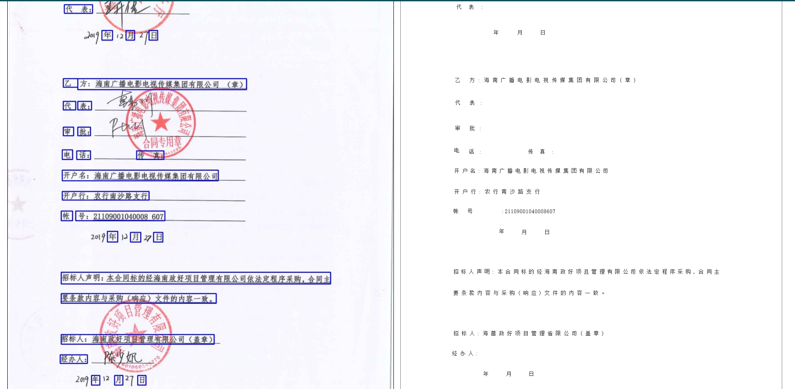

# Fast-Chinese-OCR
This project uses the most advanced AI algorithm to identify and extract contract scanned documents.

### Introduction
* A text detector based on Mask R-CNN is used, and the methods are mainly inspired by fully convolutional networks. First, CNN is adopted to detect text blocks, from which character candidates are extracted. Then FPN is used to predict the corresponding segmentation masks. Last, segmentation mask is used to find suitable rectangular bounding boxes for the text instances. 

* The [pre-trained](https://arxiv.org/abs/1703.06870) model provided on ICDAR 2017 Incidental Scene Text Detection Challenge using only training images from ICDAR 2017 and 2019. 

* This is an implementation of [Mask R-CNN](https://arxiv.org/abs/1703.06870) on Python 3, Keras, and TensorFlow. The model generates bounding boxes and segmentation masks for each instance of an object in the image. It's based on Feature Pyramid Network (FPN) and a ResNet101 backbone.

* This software implements the Convolutional Recurrent Neural Network (CRNN), a combination of CNN, RNN and CTC loss for image-based sequence recognition tasks, such as scene text recognition and OCR. For details, please refer to our paper http://arxiv.org/abs/1507.05717.

### Contents
1. [Installation](#installation)
2. [Download](#download)
2. [Demo](#demo)
3. [Test](#train)
4. [Train](#test)
5. [Examples](#examples)
6. [Result](#result)
### Installation
* Python 3.6+
* Tensorflow v2.0.0+
* opencv-python 3.4+

### Download
Models trained on ICDAR 2017 (training set) + ICDAR 2019 (training set): [Download link](https://rrc.cvc.uab.es/)

### Test

Visit the website [http://werfwef.qicp.vip/ocr/file/]

### Train

### Result
##### Using only ICDAR 2017 MLT training set and ICDAR 2019 training set. Mask R-CNN for ICDAR MLT 2017 Challenge 1 Text detection.
|             Method | Precision (%) | Recall (%) | F-measure (%)             | 
| - | - | - | - |
| Mask R-CNN-resnet101 |      83.52       |      76.58      |      79.89      |
